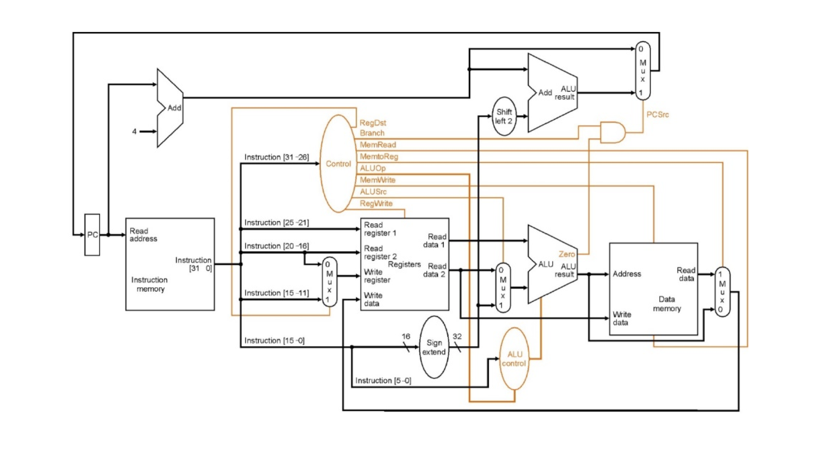

# Single-Cycle MIPS Processor

A modular single-cycle MIPS-like processor written in Verilog and verified with
Icarus Verilog. The repository contains the datapath, control logic, reusable
program images, module-level tests, and end-to-end processor tests.



## Supported instructions

| Class | Instructions |
|---|---|
| Arithmetic | `add`, `addu`, `sub`, `subu`, `addi`, `addiu` |
| Logical | `and`, `or`, `xor`, `nor`, `andi`, `ori`, `xori` |
| Shift | `sll`, `srl`, `sra` |
| Compare | `slt`, `sltu`, `slti` |
| Memory | `lw`, `sw` |
| Control flow | `beq`, `bne`, `j` |
| Immediate construction | `lui` |

Signed and unsigned comparisons are implemented separately. Logical immediate
instructions use zero extension; arithmetic and branch immediates use sign
extension.

## Project structure

- `src/` — synthesizable processor RTL
- `testbench/` — module and integration testbenches
- `programs/` — machine-code programs loaded with `$readmemh`
- `docs/` — datapath diagram and project notes

The included Fibonacci program uses `addi` for constants, counters, and pointer
updates, and stores the first 20 terms at data-memory word addresses 10 through
29.

## Run tests

Install Icarus Verilog, then run:

```bash
make test
```

The test suite covers ALU operations (including signed shifts and comparisons),
instruction decoding, memories, register file, PC behavior, immediate
extension, branches, and an end-to-end instruction program. `fib_tb` verifies
the first 20 Fibonacci values.

## Memory model

Instruction memory is byte-addressed through the PC and stores 32-bit words.
Data memory is intentionally **word-addressed** in this educational core, so
`lw $t0, 1($zero)` selects data-memory word 1 rather than byte address 1. This is
the main deliberate difference from standard MIPS memory addressing.

## Current scope

- One instruction completes per clock cycle.
- No pipeline, forwarding, stalls, exceptions, interrupts, or HI/LO unit.
- Arithmetic overflow is exposed by the ALU but does not raise an exception.
- Sub-word loads and stores and function-call instructions (`jal`/`jr`) are not
  implemented yet.

## License

MIT
